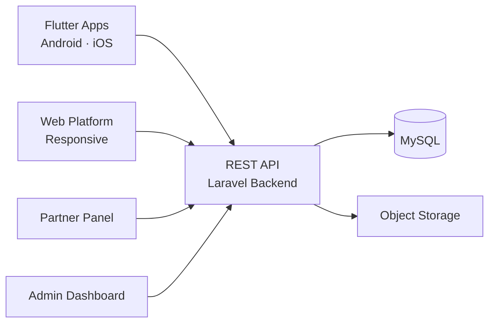

# Facebook Clone — White-Label Solution by Miracuves

---

## Table of Contents

1. [Who Is This For?](#who-is-this-for)
2. [How It Works](#how-it-works)
3. [Core Features](#core-features)
4. [Architecture](#architecture)
5. [Revenue Streams](#revenue-streams)
6. [What's Included](#whats-included)
7. [Deployment Timeline](#deployment-timeline)
8. [Why Not Build From Scratch?](#why-not-build-from-scratch)
9. [Market Opportunity](#market-opportunity)
10. [Client Testimonials](#client-testimonials)
11. [FAQ](#faq)
12. [Resources](#resources)
13. [About Miracuves](#about-miracuves)

## Live Demos

| Environment | URL | What you can test |
|---|---|---|
| Web Platform | [mxbook.mimeld.com](https://mxbook.mimeld.com) | Full experience in the browser |
| Mobile App (Android) | [mas.mimeld.com](https://mas.mimeld.com) | Browse, transact, engage |
| Admin Dashboard | [Solution page → Demo](https://miracuves.com/facebook-clone/#demo) | Users, content, plans, analytics |

Demo credentials: [miracuves.com/facebook-clone -> Demo section](https://miracuves.com/facebook-clone/#demo)

## What Makes This Facebook Clone Different

<!-- TODO: fill 3-5 vertical-specific differentiators -->

## Who Is This For?

| Buyer Type | Use Case |
|---|---|
| Startup Founders | Launch a niche social network for a specific community |
| Community Platforms | Build a dedicated social platform for members |
| Media Companies | Create a social experience around content and events |

---

## How It Works

1. User creates a profile with photos, bio, and interests
2. User connects with friends or follows pages and groups
3. News feed shows personalized content based on connections and interests
4. User interacts with posts, joins groups, and attends events
5. Messaging enables private and group conversations
6. Admin manages platform, moderation, and advertising

---

## Core Features

### User App
- Profile creation with photo, bio, and cover image
- News feed with like, comment, and share interactions
- Groups and community management
- Events creation and RSVP
- Marketplace for buying and selling
- Friend/follow system with notifications

### Messaging
- Private messaging with read receipts
- Group chats with admin controls
- Media sharing (photos, videos, files)
- Voice and video calling

### Pages and Business Tools
- Business page creation with analytics
- Post scheduling and insights
- Ad creation with targeting options
- Messenger bot integration

### Admin Panel
- User moderation and content review
- Ad platform management and revenue reports
- Page and group analytics
- Platform-wide engagement metrics

---

## Advanced Features

The platform integrates AI-powered features that reduce manual overhead and capture revenue opportunities:

- **AI Feed Ranking** - Personalized feed algorithm that optimizes for engagement
- **AI Content Moderation** - Automatic detection of inappropriate content and spam
- **AI Friend Suggestions** - Algorithm-based friend and group recommendations
- **AI Ad Targeting** - Audience segmentation and ad performance optimization

---

## Apps and Web Panels

| Module | Description |
|---|---|
| User App (iOS + Android) | Feed, profile, groups, messaging, marketplace |
| Business Pages (Web) | Page management, ads, analytics |
| Admin Web Panel | Users, content, ads, moderation |

---

## Architecture

**Stack:**

| Layer | Technology |
|---|---|
| Mobile Apps | Flutter (iOS + Android, single codebase) |
| Web Platform | React.js |
| Backend API | Node.js + Express |
| Database | MongoDB + Redis (caching) |
| Real-time | WebSockets (Socket.io) |
| Payments | Stripe, Razorpay, PayPal |
| Notifications | Firebase Cloud Messaging (FCM) |
| Cloud Hosting | AWS / DigitalOcean / Contabo VPS |

---

## Revenue Streams

The platform is engineered to generate revenue from day one through multiple complementary channels:

- **Advertising** - targeted ad placements with CPM/CPC pricing
- **Promoted posts** - businesses pay for post visibility
- **Page subscriptions** - monthly fee for business page features
- **Marketplace fees** - transaction fees on marketplace sales

---

## Security and Compliance

- OTP-based authentication
- SSL/TLS encrypted API communication
- GDPR-ready data handling

---

## What's Included

| Plan | Price | What You Get |
|---|---|---|
| Standard | **$$2,899** | Complete source code, all apps, admin panel, rebranding, 1 year updates |
| Enterprise | Custom Quote | Everything in Standard + custom features, multi-region, priority support |

**What is included:**

- User App (iOS + Android)
- Business Pages (Web)
- Admin Web Panel
- Full Source Code
- Complete Rebranding (your logo, colors, app name)
- Server Deployment
- App Store and Google Play Submission Support
- 60 Days Free Bug Support
- Free 1-Year Updates

---
**Pricing:** from **$2,899** — transparent on the [solution page](https://miracuves.com/facebook-clone/#pricing).

## Deployment Timeline

| Day | Milestone |
|---|---|
| Day 1 | Server setup, environment configuration, initial deployment |
| Day 2 | White-labeling - app name, logo, colors, splash screens |
| Day 3 | Payment gateway integration + third-party API configuration |
| Day 4 | Custom feature implementation (if applicable) |
| Day 5 | QA, testing, bug fixes across all panels |
| Day 6 | App Store + Google Play submission + Go-live |

> **Average go-live: 6 business days from payment confirmation.**

---

## Why Not Build From Scratch?

| Factor | Build from Scratch | Miracuves Solution |
|---|---|---|
| Time to Launch | 6-12 months | 6 days |
| Development Cost | $60,000-$150,000 | From $$2,899 |
| Source Code Ownership | Yes | Yes |
| Customization | Full | Full |
| Post-Launch Support | Depends on team | 60 days included |
| Risk | High | Low |

---

## Market Opportunity

| Metric | Data |
|---|---|
| Global Social Media Market (2024) | $240 billion |
| Projected Market Size (2030) | $310 billion |
| CAGR | ~5% |
| Key Growth Markets | USA, India, Brazil, Indonesia, Nigeria |
| Average Daily Time Spent | 2.5 hours |

> Source: Statista, Grand View Research, Allied Market Research

---

## Successful Verticals

- Niche social networks
- Community platforms for specific interests
- Professional networking platforms
- Event-focused social discovery apps

---

## Client Testimonials

> *"The news feed algorithm is incredibly engaging. Our users spend an average of 45 minutes per day on the platform."*
> - Founder, Social Network

---

## FAQ

**How much does a Facebook clone cost?**
A white-label Facebook clone from Miracuves starts at $2,899 with complete source code ownership.

**Does it include an ad engine?**
Yes. A full advertising platform with audience targeting and analytics.

**Can I create groups?**
Yes. Interest-based groups with admin controls and moderation.

**Is messaging included?**
Yes. Private messaging, group chats, and voice/video calling.

**Do I get the source code?**
Yes. Complete source code ownership is included.

**How long does it take to launch?**
6 business days from payment confirmation.

---

## Related Solutions

Explore our other white-label clone solutions:

- [Twitter Clone - Social Media](https://github.com/Miracuves-Solutions/Twitter-Clone)
- [Instagram Clone - Photo Sharing](https://github.com/Miracuves-Solutions/Instagram-Clone)
- [LinkedIn Clone - Professional Network](https://github.com/Miracuves-Solutions/LinkedIn-Clone)

---

## Resources

- [Full Solution Page](https://miracuves.com/facebook-clone/) — features, pricing, demos, FAQ

## Get Started

**Ready to launch your social networking platform?**

| Channel | Link |
|---|---|
| Full Solution Page | [miracuves.com/facebook-clone](https://miracuves.com/facebook-clone/) |
| Email | info@miracuves.com |
| WhatsApp | [+91 98300 09649](https://wa.me/919830009649) |
| Book a Call | [Free Consultation](https://miracuves.com/contact/) |

---

## About Miracuves

**Miracuves Solutions Pvt. Ltd.** is a Mumbai-based software company specializing in white-label clone app solutions across 12+ industries.

- 90+ ready-to-deploy solutions
- 6-day delivery guarantee
- 60+ engineers on staff
- 3,900+ apps delivered
- Full source code ownership
- Clients across 40+ countries including India and USA

[Explore all 90+ solutions at miracuves.com](https://miracuves.com)

---

## Disclaimer

This product is independently developed by Miracuves. All product names, logos, and brands are property of their respective owners. Use of these names does not imply endorsement.

---

*(c) 2026 Miracuves Solutions Pvt. Ltd. | Mumbai, India*
*This repository contains product documentation only - no proprietary source code is published here.*

*Keywords: facebook clone, facebook script, white label solution, laravel flutter app, clone script*

---

### Note on This Repository

This repository is a product overview. The full source code is delivered to clients on purchase. For a hands-on evaluation, use the live demos above; credentials are public on the solution page.

<!--
=========================================================
GENERATED FROM MIRACUVES NETFLIX-CLONE README TEMPLATE
Canon: 6 working days, from $2,799 floor, 60 days support + 12 months updates.
Never use 3 days. See https://miracuves.com/facts/ for audited claims.
=========================================================
-->
